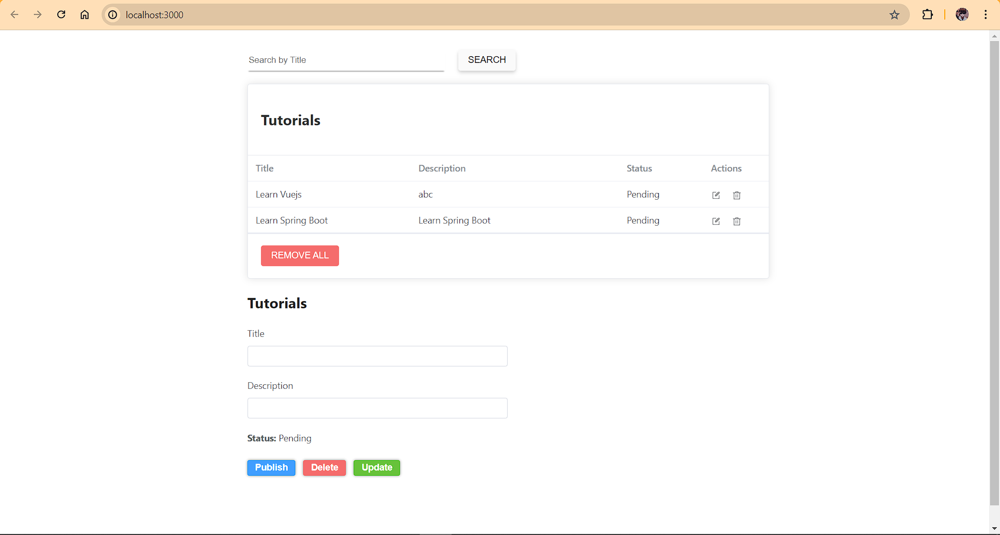

Họ và tên: Lê Vũ Minh Nghĩa

Email: [lenghia1007@gmail.com]()

Thời gian nhận bài tập: 17:30 27/06/2024

Thời gian báo cáo: 20:50 27/06/2024

Công nghệ sử dụng: Vue3, Vite, TypeScript, Element Plus

## 1. Chức năng thêm phần tử

- Nhập dữ liệu vào phần `Title` và `Description` trong phần form ở dưới.

- Sau đó click vào nút `Publish` để thêm phần tử.

## 2. Chức năng hiển thị phần tử ra bảng

- Dữ liệu sẽ được hiển thị ra dưới dạng bảng, nếu mà chưa có dữ liệu thì trong bảng hiện thị dòng chữ `No Data`.

## 3. Chức năng sửa phần tử

- Click vào icon `Edit` vào hàng mà mình muốn sửa.

- Thông tin của phần tử mình muốn sửa (không chỉnh sửa phần thông tin `Tilte`) sẽ hiển thị ra trong form.

- Nhập trường thông tin cần sửa và click vào nút `Update`. Thông tin được cập nhật sẽ hiển thị ngay ra trên bảng.

## 4. Chức năng xóa phần tử

- Click vào icon `Delete` vào hàng mà mình muốn xóa. Sau khi khóa xong dữ liệu trong bảng được cập nhật và hiển thị ra bảng.

## 5. Chức năng tìm kiếm theo `Title`

- Khi mà trong ô `input` mà trống. Khi click nút `Search` thì sẽ trả về tất cả dữ liệu hiện tại.

- Khi mà trong ô `input` có dữ liệu nhập vào. Khi click nút `Search` thì sẽ trả về những phần tử theo `Title` mà mình cần tìm.

## 6. Chức năng xóa tất cả

- Khi click vào nút `REMOVE ALL` thì dữ liệu trong bảng sẽ bị xóa sạch.

